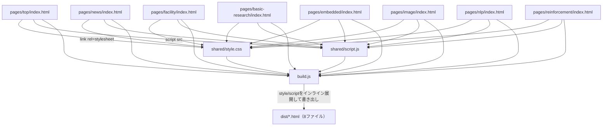
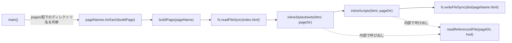

# document.md：AI R&D Center Webサイト再構築プロジェクト

本ドキュメントは，本プロジェクトで作成したプログラム・文書の役割，依存関係，実行方法を記述する．対応する指示書は`.orders/order_001.md`，実施レポートは`.reports/report_001.md`である．

## 1. ディレクトリ・ファイルの役割

| パス | 役割 |
| :--- | :--- |
| `shared/style.css` | 全ページ共通のスタイルシート．ダークテーマ・青アクセントの配色，タイポグラフィ，カード・アコーディオン・タブ等のコンポーネントを定義する． |
| `shared/script.js` | 全ページ共通のスクリプト．ナビゲーション開閉，スクロール進捗バー，ニュースティッカー，タブ切り替え，アコーディオン開閉を制御する． |
| `pages/*/index.html` | 各ページのHTMLソース（8ページ）．`<html>`/`<head>`/`<body>`を持たないフラグメントで，末尾に`shared/`を参照する`<link>`・`<script>`タグを持つ． |
| `build.js` | `pages/`配下を走査し，`shared/`の中身をインライン展開して`dist/`へ出力するビルドスクリプト．Node.js標準機能のみで動作する． |
| `dist/*.html` | `node build.js`実行後に生成される，外部依存のない単一HTMLファイル．ArtisCMS3の「埋め込みHTML」欄にそのまま貼り付けられる． |
| `package.json` | `npm run build`で`node build.js`を実行できるようにするための最小限の定義．依存パッケージはない． |
| `README.md` | フォルダ構成，ビルド方法，ローカルでの確認方法，ArtisCMS3側URLとの対応表（運用者記入欄）を記載する運用者向け文書． |
| `.orders/order_001.md` | 本プロジェクトの指示書． |
| `.reports/report_001.md` | 本プロジェクトの実施レポート． |

## 2. プログラム間の依存関係



`build.js`内の主要な関数と処理の流れは次のとおりである．



- `main()`：`dist/`ディレクトリを作成し，`pages/`直下のディレクトリ名を列挙して`buildPage`を順次呼び出すエントリポイント．
- `buildPage(pageName)`：1ページ分の`index.html`を読み込み，スタイル・スクリプトのインライン展開を行ったうえで`dist/{pageName}.html`へ書き出す．
- `inlineStylesheets(html, pageDir)`：`<link rel="stylesheet" href="...">`を正規表現で検出し，`readReferencedFile`で読み込んだCSSの中身を`<style>`タグとして埋め込む．
- `inlineScripts(html, pageDir)`：`<script src="...">`を正規表現で検出し，`readReferencedFile`で読み込んだJSの中身を`<script>`タグとして埋め込む．
- `readReferencedFile(pageDir, relativeHref)`：ページのディレクトリを起点とした相対パスから，参照先ファイルの中身をUTF-8テキストとして読み込む共通処理．

## 3. 外部モジュールとの依存関係

`build.js`はNode.js標準モジュール（`fs`，`path`）のみに依存しており，npmパッケージへの依存はない．`node build.js`のみでビルドが完了する．

`dist/`配下の出力ファイル自体も，外部CDN（Google Fonts，jsDelivr等）への依存を持たない．画像のみ，湘南工科大学公式サイト（`https://www.shonan-it.ac.jp/`）上の既存画像を絶対URLで参照している．

## 4. Node.js環境の構築方法

本プロジェクトは特別な仮想環境を必要としない．Node.js（標準機能のみ使用，バージョンは14以降であれば動作する想定）がインストールされていれば，追加のパッケージインストールなしで次のコマンドを実行できる．

```bash
node build.js
# または
npm run build
```

開発中の動作確認時，実行環境に`node`コマンドが存在しなかったため，Node.js v20.17.0のLinux x64バイナリをユーザー権限で`/tmp`配下にダウンロード・展開し，一時的にPATHへ追加して使用した．システムへの恒久的なインストールは行っていない．運用環境で`node`コマンドが利用できない場合は，同様の方法か，通常のNode.jsインストール手順（公式サイトやパッケージマネージャ経由）で導入する必要がある．

## 5. プログラムの実行方法

```bash
cd project  # 本リポジトリのルート
node build.js
```

実行すると，`dist/`配下に以下8ファイルが生成される．

```
dist/top.html
dist/news.html
dist/facility.html
dist/basic-research.html
dist/embedded.html
dist/image.html
dist/nlp.html
dist/reinforcement.html
```

## 6. ローカルでの表示確認方法

`dist/`配下のファイルは`<html>`/`<head>`を持たないHTMLフラグメントであるため，ダブルクリックで直接開くのではなく，簡易HTTPサーバーで配信して確認する．文字化けを避けるため，`Content-Type: text/html; charset=utf-8`を明示できる配信方法を用いることが望ましい（詳細は`README.md`を参照）．

```bash
cd dist
python3 -m http.server 8000
# ブラウザで http://localhost:8000/top.html 等にアクセス
```

## 7. 実験結果・成果物の保存場所

本プロジェクトは機械学習実験を伴わないため，学習ログやモデル等の成果物は存在しない．成果物は次のとおりである．

- ソースコード：`shared/`，`pages/`，`build.js`
- ビルド成果物：`dist/`（`node build.js`実行のたびに再生成される）
- 表示確認に用いたスクリーンショット：本セッションの一時領域にのみ保存しており，リポジトリ内には含めていない

## 8. 文書・レポートの保存場所

- 指示書：`.orders/order_001.md`
- 実施レポート：`.reports/report_001.md`
- 本ドキュメント：`document.md`（リポジトリルート）

## 9. 必要なAPIキー・設定ファイル

本プロジェクトはAPIキーを必要としない．`tokens.json`および`tokens.json.enc`はリポジトリ内に存在するが，本プロジェクトのビルド・表示確認では使用していない．`tokens.json`は`.gitignore`により追跡対象外である．

## 10. Git管理上の注意事項

- `tokens.json`は`.gitignore`に登録済みであり，コミット対象外である．
- `dist/`は`build.js`実行のたびに再生成される成果物であるため，リポジトリへコミットするかどうかは運用方針に応じて判断する（本プロジェクトでは`.gitignore`に追加していないため，現状はコミット対象に含まれる）．
- ビルド確認のためにダウンロードしたNode.jsバイナリは`/tmp`配下の一時領域に配置したものであり，リポジトリには含まれていない．
