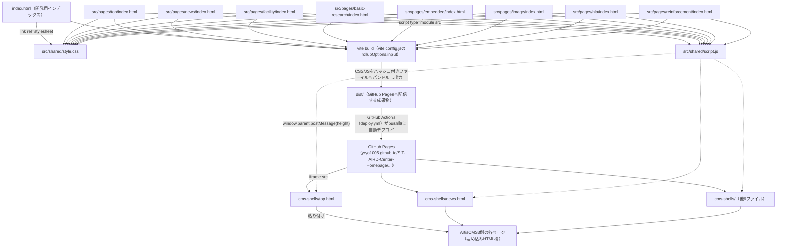
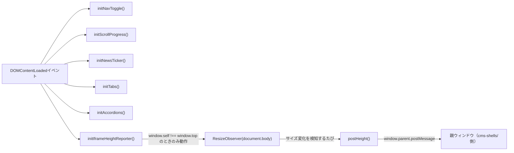

# document.md：AI R&D Center Webサイト再構築プロジェクト（v2：Vite + GitHub Pages + iframe）

本ドキュメントは，本プロジェクトで作成したプログラム・文書の役割，依存関係，実行方法を記述する．対応する指示書は`.orders/order_001.md`（v1：ArtisCMS3直接貼り付け版），`.orders/order_002.md`（v2：Vite + GitHub Pages + iframe版），`.orders/order_003.md`（v2追加修正：公開URL修正・画像表示修正），実施レポートは`.reports/report_001.md`〜`.reports/report_003.md`である．

v2では，v1で採用していた「build.jsでCSS/JSをインライン展開し，1ページ1ファイルのHTMLフラグメントをArtisCMS3へ直接貼り付ける」方式を廃止し，「GitHub Pagesで本体をホストし，ArtisCMS3側は該当ページを表示するiframeシェルのみを貼り付ける」方式へ全面移行した．v1の`pages/`・`shared/`・`build.js`・`dist/`は本移行に伴い削除している．

`.orders/order_003.md`への対応で，GitHub PagesのベースURL（リポジトリ名を含むパス）を`site.config.js`に一元化し，`vite.config.js`・`cms-shells/*.html`・README.mdの3箇所がそこから導出されるようにした（詳細は本ドキュメント末尾の「12. v2追加修正（order_003）の内容」を参照）．

## 1. ディレクトリ・ファイルの役割

| パス | 役割 |
| :--- | :--- |
| `src/shared/style.css` | 全ページ共通のスタイルシート．ダークテーマ・青アクセントの配色，タイポグラフィ，カード・アコーディオン・タブ等のコンポーネントを定義する．内容はv1の`shared/style.css`を踏襲している． |
| `src/shared/script.js` | 全ページ共通のスクリプト．ナビゲーション開閉，スクロール進捗バー，ニュースティッカー，タブ切り替え，アコーディオン開閉に加え，v2で追加した「iframe埋め込み時に本文の高さを親ウィンドウへ通知する処理」を含む． |
| `src/pages/*/index.html` | 各ページのHTMLソース（8ページ）．`<!DOCTYPE html>`から始まる完全なHTMLドキュメントで，`<head>`の最初の子要素として`<meta charset="UTF-8">`を宣言する．内部リンクはすべてルート相対パス＋`target="_top"`． |
| `index.html`（リポジトリルート） | ローカル確認専用の開発用インデックスページ．各ページへのリンク一覧を表示する．CMS・本番公開の対象ではない． |
| `vite.config.js` | Viteのビルド設定．`src/pages/*/index.html`（8ファイル）とルートの`index.html`を複数エントリとして`dist/`へビルドする．GitHub Pagesのサブパス公開に対応するため，`mode`が`"production"`のとき（`vite build`・`vite preview`）のみ`base`を`/SIT-AIRD-Center-Homepage/`に設定する． |
| `cms-shells/*.html` | ArtisCMS3の「埋め込みHTML」欄に貼り付けるための，ページごとの短いiframeシェル（8ファイル）．GitHub PagesのURLを`src`に持つ`iframe`と，高さ調整用の`postMessage`受信スクリプトから成る．**手動編集はせず，`scripts/generate-cms-shells.js`で`site.config.js`から生成する．** |
| `site.config.js` | GitHub PagesのベースURL（`BASE_PATH`・`SITE_BASE_URL`）とページ一覧（`PAGES`）を定義する単一の情報源．`vite.config.js`と`scripts/generate-cms-shells.js`の両方がここから読み込む（order_003対応で追加）． |
| `scripts/generate-cms-shells.js` | `site.config.js`から`cms-shells/*.html`を生成するスクリプト（order_003対応で追加）． |
| `scripts/verify-cms-shells.js` | `cms-shells/*.html`が`site.config.js`の内容と一致しているか，README.md記載のURLと一致しているか，（`--live`指定時）GitHub Pages公開URLが実際に200を返すかを検証するスクリプト（order_003対応で追加）． |
| `.github/workflows/deploy.yml` | `main`ブランチへのpush時に`npm ci` → `npm run build` → GitHub Pagesへデプロイを自動実行するGitHub Actionsワークフロー． |
| `package.json` / `package-lock.json` | Vite関連の依存関係定義．`npm run dev` / `npm run build` / `npm run preview` / `npm run generate:cms-shells` / `npm run verify:cms-shells` / `npm run verify:cms-shells:live`を提供する． |
| `README.md` | フォルダ構成，配信アーキテクチャ，ベースURLの単一管理（site.config.js），ローカルでの動作確認方法，本番ビルド手順，GitHub Pages公開URL，cms-shellsの使い方，ArtisCMS3側URLとの対応表（運用者記入欄）を記載する運用者向け文書． |
| `.orders/order_001.md`〜`.orders/order_003.md` | 本プロジェクトの指示書（v1，v2，v2追加修正）． |
| `.reports/report_001.md`〜`.reports/report_003.md` | 本プロジェクトの実施レポート（v1，v2，v2追加修正）． |

## 2. プログラム間の依存関係



`src/shared/script.js`内の主要な関数と処理の流れは次のとおりである．



- `initNavToggle`：ハンバーガーメニューの開閉．
- `initScrollProgress`：スクロール量に応じた進捗バーの幅更新．
- `initNewsTicker`：`prefers-reduced-motion`を考慮した上で，ニュースティッカーの中身を複製しシームレスループを実現．
- `initTabs`：`data-tabs`属性を持つタブUIの切り替え．
- `initAccordions`：業績一覧等のアコーディオン開閉．
- `initIframeHeightReporter`：v2で追加．`window.self !== window.top`（iframe埋め込み状態）のときのみ動作し，`ResizeObserver`で本文（`document.body`）の高さ変化を検知して`postMessage`で親ウィンドウへ通知する．GitHub Pagesを単独で開いた場合は何も行わない．

`cms-shells/*.html`側は，対応する`message`イベント（`type: "ai-rd-center:height"`）を受信し，`iframe`要素の`style.height`を更新するインラインスクリプトを持つ．

## 3. 外部モジュールとの依存関係

- ビルドツールとして`vite`（`devDependencies`）に依存する．`npm install`で導入する．
- サイト本体（`src/pages/*/index.html`が生成する成果物）は，外部CDN（Google Fonts，jsDelivr，GSAP等）へ依存していない．アニメーションはGSAP等を使わず，素のCSS（`@keyframes`，`transition`）とJavaScript（`ResizeObserver`，`matchMedia`）のみで実装している．
- 画像のみ，湘南工科大学公式サイト（`https://www.shonan-it.ac.jp/`）上の既存画像を絶対URLで参照している．

## 4. Node.js環境の構築方法

```bash
npm install
```

上記でVite等の開発依存関係が`node_modules/`にインストールされる．`node_modules/`は`.gitignore`で除外している．

開発中の動作確認時，実行環境に`node`コマンドが存在しなかったため，Node.js v20.17.0のLinux x64バイナリをユーザー権限で`/tmp`配下にダウンロード・展開し，一時的にPATHへ追加して使用した．システムへの恒久的なインストールは行っていない．GitHub Actions上ではv2で追加した`.github/workflows/deploy.yml`が`actions/setup-node@v4`でNode.js 20を用意するため，この問題は発生しない．

## 5. プログラムの実行方法

```bash
# ローカル開発サーバー
npm run dev

# 本番ビルド（dist/に出力）
npm run build

# 本番ビルドのプレビュー（GitHub Pagesと同じbase設定で確認）
npm run preview
```

`vite.config.js`の`rollupOptions.input`にエントリとして列挙した9つのHTMLファイル（開発用インデックス1つ＋ページ8つ）が，それぞれ`dist/`配下の対応するパス（例：`dist/src/pages/top/index.html`）へ出力される．出力パスはVite側の仕様により，ソースファイルの`root`（プロジェクトルート）からの相対パスがそのまま使われる（`rollupOptions.input`のオブジェクトキーは出力ファイル名を決定しない）．

## 6. デプロイ方法（GitHub Actions → GitHub Pages）

`main`ブランチへのpush，または手動実行（`workflow_dispatch`）により，`.github/workflows/deploy.yml`が次を実行する．

1. `actions/checkout`でリポジトリを取得
2. `actions/setup-node`でNode.js 20を用意
3. `npm ci`で依存関係をインストール（`package-lock.json`を使用するため，再現性のあるインストールになる）
4. `npm run build`で`dist/`を生成
5. `actions/upload-pages-artifact`で`dist/`をアーティファクトとしてアップロード
6. `actions/deploy-pages`でGitHub Pagesへデプロイ

初回のみ，リポジトリのSettings → PagesでSourceを「GitHub Actions」に設定する必要がある（運用者の作業）．

## 7. ローカルでの表示確認方法

`README.md`の「ローカルでの動作確認方法」を参照．開発サーバー（`npm run dev`）と本番ビルドのプレビュー（`npm run preview`）の双方で，Playwright（Chromium）を用いて日本語表示・レイアウト崩れ・コンソールエラーの有無を確認済みである．

さらに，v2で追加したiframe高さ自動調整機構（`postMessage`）についても，`npm run build`の成果物を`vite preview`で配信し，別オリジンの簡易HTTPサーバー上に置いたテスト用iframeシェルから読み込む形で，実際にクロスオリジンでの高さ通知が機能することを確認済みである．

## 8. 実験結果・成果物の保存場所

本プロジェクトは機械学習実験を伴わないため，学習ログやモデル等の成果物は存在しない．成果物は次のとおりである．

- ソースコード：`src/`，`vite.config.js`，`.github/workflows/deploy.yml`，`cms-shells/`
- ビルド成果物：`dist/`（`npm run build`実行のたびに再生成される，`.gitignore`によりリポジトリには含めない）
- 表示確認に用いたスクリーンショット：本セッションの一時領域にのみ保存しており，リポジトリ内には含めていない

## 9. 文書・レポートの保存場所

- 指示書：`.orders/order_001.md`（v1），`.orders/order_002.md`（v2），`.orders/order_003.md`（v2追加修正）
- 実施レポート：`.reports/report_001.md`（v1），`.reports/report_002.md`（v2），`.reports/report_003.md`（v2追加修正）
- 本ドキュメント：`document.md`（リポジトリルート）

## 10. 必要なAPIキー・設定ファイル

本プロジェクトはAPIキーを必要としない．`tokens.json`・`tokens.json.enc`はリポジトリ内に存在するが，本プロジェクトのビルド・デプロイでは使用していない．`tokens.json`は`.gitignore`により追跡対象外である．GitHub Actionsのデプロイには，GitHub Pages用に自動発行される`GITHUB_TOKEN`（`actions/deploy-pages`が内部で使用）以外の秘匿情報は不要である．

## 11. Git管理上の注意事項

- `tokens.json`，`node_modules/`，`dist/`は`.gitignore`に登録済みであり，コミット対象外である．
- `package-lock.json`はGitHub Actionsの`npm ci`が依存関係の再現性を担保するために必要なため，コミット対象に含めている．
- v1で作成した`pages/`・`shared/`・`build.js`・（v1の）`dist/`は，v2への移行に伴い削除済みである．v1の実装内容は`git log`および`.reports/report_001.md`で参照できる．

## 12. v2追加修正（order_003）の内容

`.orders/order_003.md`は，GitHub Pages有効化後の実地検証で見つかった2点の不具合の修正指示である．

### 12.1 ベースURLの単一管理化

修正前は`cms-shells/*.html`（8ファイル）のiframe `src`を手作業で個別に記述していたため，ファイルごとの記述漏れ・食い違いが起こり得る状態だった（実際に，ニュースページのcms-shellsでリポジトリ名パスが抜けて404になっていたことが報告された）。

これに対し，`site.config.js`を新設し，GitHub PagesのベースURL（`BASE_PATH`・`SITE_BASE_URL`）とページ一覧（`PAGES`：各ページの`key`・`srcPath`・`cmsPath`・`title`）を一元管理する構成へ変更した。

- `vite.config.js`は`site.config.js`から`BASE_PATH`・`PAGES`を直接importし，`base`設定とビルドエントリ（`rollupOptions.input`）を構築する。
- `scripts/generate-cms-shells.js`は`site.config.js`から`cms-shells/*.html`を機械的に生成する。手動編集は行わない運用とし，各生成ファイルの先頭コメントにもその旨を明記した。
- `scripts/verify-cms-shells.js`は，(1) `cms-shells/*.html`が`site.config.js`から生成される内容と一致しているか，(2) README.md記載の公開URL例が`site.config.js`の算出結果と一致しているか，(3) （`--live`指定時）各ページの公開URLが実際にHTTP 200を返すか，を検証する。

`npm run verify:cms-shells:live`を実行し，8ページ全件がHTTP 200であることを確認済みである（`.reports/report_003.md`参照）。

### 12.2 画像が表示されない問題の調査

1. 各ページのHTMLソースを確認し，``の実装自体に漏れがないことを確認した（問題なし）。
2. GitHub Pages上の実ページ（`https://yryo1005.github.io/SIT-AIRD-Center-Homepage/src/pages/top/index.html`ほか）をPlaywright（Chromium）で開き，Networkログ・Consoleログを確認した。大半の試行では全画像が200で正常に読み込まれたが，1回のみ全画像が`net::ERR_CONNECTION_CLOSED`で失敗する事象が発生した（直後の再試行では再現しなかった）。
3. 同一画像URLに対してRefererヘッダーを変えたcurlリクエスト（Refererなし／GitHub PagesのURL／公式サイト自身のURL）はいずれも200を返し，403等のホットリンク対策由来と断定できる証拠は得られなかった。
4. 以上より，観測された失敗はホットリンク対策（Refererチェック）による恒常的な拒否ではなく，一時的なネットワーク不安定性である可能性が高いと判断した。ただし，実際のユーザー環境やCMS埋め込み時のネットワーク条件でReferer起因の拒否が発生する可能性を完全には排除できないため，指示書が提示する予防策に従い，全``タグに`referrerpolicy="no-referrer"`属性を追加した。この変更は，別オリジンから画像を読み込む際にRefererヘッダーを送信しないようにする安全側の対応であり，副作用はない。

推測にもとづく断定的な原因確定や，スコープ外とされているGitHub Releaseへの画像移設は行っていない。詳細な検証ログは`.reports/report_003.md`を参照。
