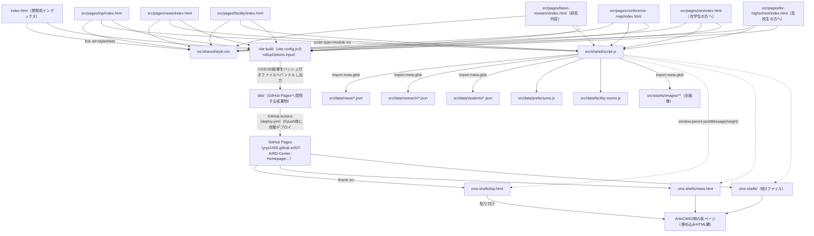
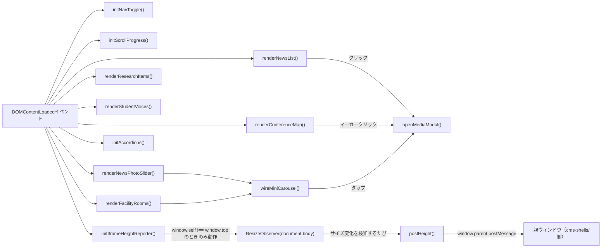

# document.md：AI R&D Center Webサイト再構築プロジェクト（v2：Vite + GitHub Pages + iframe）

本ドキュメントは，本プロジェクトで作成したプログラム・文書の役割，依存関係，実行方法を記述する．対応する指示書は`.orders/order_001.md`（v1：ArtisCMS3直接貼り付け版），`.orders/order_002.md`（v2：Vite + GitHub Pages + iframe版），`.orders/order_003.md`（v2追加修正：公開URL修正・画像表示修正），`.orders/order_004.md`（ガイダンス資料の取り込み），`.orders/order_005.md`（デザイン刷新・内部リンクのモード切り替え），`.orders/order_006.md`（表示内容の精査・修正），`.orders/order_007.md`（コンテンツのデータファイル駆動化：ニュース），実施レポートは`.reports/report_001.md`〜`.reports/report_007.md`である．

`.orders/order_004.md`への対応で，`references/`配下のガイダンス資料（PPTX/PDF）から抽出したテキスト・画像を，公式サイトの内容を削除・改変することなくサイトへ追加した．写真は`src/assets/images/`に配置し，Viteの標準アセットパイプラインで処理される．`references/`自体は大容量ファイル（最大255MB，GitHubの単一ファイル上限100MBを超過）を含むため`.gitignore`に追加し，リポジトリには含めていない（詳細は`.reports/report_004.md`を参照）．

v2では，v1で採用していた「build.jsでCSS/JSをインライン展開し，1ページ1ファイルのHTMLフラグメントをArtisCMS3へ直接貼り付ける」方式を廃止し，「GitHub Pagesで本体をホストし，ArtisCMS3側は該当ページを表示するiframeシェルのみを貼り付ける」方式へ全面移行した．v1の`pages/`・`shared/`・`build.js`・`dist/`は本移行に伴い削除している．

`.orders/order_003.md`への対応で，GitHub PagesのベースURL（リポジトリ名を含むパス）を`site.config.js`に一元化し，`vite.config.js`・`cms-shells/*.html`・README.mdの3箇所がそこから導出されるようにした（詳細は本ドキュメント末尾の「12. v2追加修正（order_003）の内容」を参照）．

## 1. ディレクトリ・ファイルの役割

| パス | 役割 |
| :--- | :--- |
| `src/shared/style.css` | 全ページ共通のスタイルシート．**白背景＋青アクセントのライトテーマ**（order_005でダークテーマから刷新）．Fraunces／Inter／IBM Plex Monoのタイポグラフィ，カード・アコーディオン・ミニカルーセル・モーダル等のコンポーネントを定義する． |
| `src/shared/script.js` | 全ページ共通のスクリプト．ナビゲーション開閉，スクロール進捗バー，ニュース／研究内容／学生の声／業績一覧のJSON・データ描画，アコーディオン開閉，ミニカルーセル（複数画像の横スライド切り替え），汎用ポップアップ（`openMediaModal()`），学会行脚マップ・施設ページのフォルダアップロード対応描画，PDF等ダウンロード資料のリンク解決（`wireDownloadLinks()`，order_017），各ページの見出しから自動生成する目次ナビゲーション（`initTableOfContents()`，order_018），学会行脚マップのランダム写真スポットライト（`renderConferenceMapSpotlight()`，order_018）に加え，「iframe埋め込み時に本文の高さを親ウィンドウへ通知する処理」を含む．文字のみのニューストリッカーとタブ切り替えUIはorder_010・013で廃止済み． |
| `src/pages/*/index.html` | 各ページのHTMLソース（現在7ページ：top／news／facility／basic-research（表示名は「研究内容」）／conference-map／join（在学生の方へ）／for-highschool（高校生の方へ）。組込AI・画像処理・NLPの3ページはorder_014で研究内容ページへ統合され廃止）．`<!DOCTYPE html>`から始まる完全なHTMLドキュメントで，`<head>`の最初の子要素として`<meta charset="UTF-8">`を宣言する．内部リンクはすべてルート相対パス＋`target="_top"`． |
| `index.html`（リポジトリルート） | ローカル確認専用の開発用インデックスページ．各ページへのリンク一覧を表示する．CMS・本番公開の対象ではない． |
| `vite.config.js` | Viteのビルド設定．`src/pages/*/index.html`（7ファイル）とルートの`index.html`を複数エントリとして`dist/`へビルドする．GitHub Pagesのサブパス公開に対応するため，`mode`が`"production"`のとき（`vite build`・`vite preview`）のみ`base`を`/SIT-AIRD-Center-Homepage/`に設定する． |
| `cms-shells/*.html` | ArtisCMS3の「埋め込みHTML」欄に貼り付けるための，ページごとの短いiframeシェル（7ファイル）．GitHub PagesのURLを`src`に持つ`iframe`と，高さ調整用の`postMessage`受信スクリプトから成る．**手動編集はせず，`scripts/generate-cms-shells.js`で`site.config.js`から生成する．** |
| `site.config.js` | GitHub PagesのベースURL（`BASE_PATH`・`SITE_BASE_URL`）とページ一覧（`PAGES`）を定義する単一の情報源．`vite.config.js`と`scripts/generate-cms-shells.js`の両方がここから読み込む（order_003対応で追加）． |
| `scripts/generate-cms-shells.js` | `site.config.js`から`cms-shells/*.html`を生成するスクリプト（order_003対応で追加）． |
| `scripts/verify-cms-shells.js` | `cms-shells/*.html`が`site.config.js`の内容と一致しているか，README.md記載のURLと一致しているか，（`--live`指定時）GitHub Pages公開URLが実際に200を返すかを検証するスクリプト（order_003対応で追加）． |
| `.github/workflows/deploy.yml` | `main`ブランチへのpush時に`npm ci` → `npm run build` → GitHub Pagesへデプロイを自動実行するGitHub Actionsワークフロー． |
| `package.json` / `package-lock.json` | Vite関連の依存関係定義．`npm run dev` / `npm run build` / `npm run preview` / `npm run generate:cms-shells` / `npm run verify:cms-shells` / `npm run verify:cms-shells:live`を提供する． |
| `README.md` | フォルダ構成，配信アーキテクチャ，ベースURLの単一管理（site.config.js），ローカルでの動作確認方法，本番ビルド手順，GitHub Pages公開URL，cms-shellsの使い方，ArtisCMS3側URLとの対応表（運用者記入欄）を記載する運用者向け文書． |
| `src/assets/images/faculty/`・`src/assets/images/facility/` | ガイダンス資料（PPTX）から元画質のまま抽出した教員写真・施設写真．Viteの標準アセットパイプラインで処理される（order_004対応で追加）． |
| `src/assets/images/join/` | 在学生の方へページの活動写真（東京ゲームショウ・BBQ・ボウリング大会・忘年会・OB会）．`import.meta.glob`経由で参照される（order_017対応で追加）． |
| `src/assets/documents/` | ダウンロード資料（紹介ポスターPDF等）．`src/shared/script.js`の`resolveDocumentPath()`/`wireDownloadLinks()`により，`data-download`属性を持つ`<a>`要素のhrefが実際のURLへ書き換えられる（order_017対応で追加）． |
| `.orders/order_001.md`〜`.orders/order_005.md` | 本プロジェクトの指示書（v1，v2，v2追加修正，ガイダンス資料取り込み，デザイン刷新）． |
| `.reports/report_001.md`〜`.reports/report_005.md` | 本プロジェクトの実施レポート（v1，v2，v2追加修正，ガイダンス資料取り込み，デザイン刷新）． |
| `scripts/set-link-mode.js` | `data-link`/`data-hash`属性から，内部リンクのhref/targetをgithub-pages/cmsモードに応じて一括書き換えるスクリプト（order_005対応で追加）． |

## 2. プログラム間の依存関係



`src/pages/embedded/`・`src/pages/image/`・`src/pages/nlp/`・`src/pages/reinforcement/`の4ページは，order_010（強化学習）・order_014（組込AI・画像処理・NLP）でそれぞれ廃止済みである．現在の研究内容ページ（`basic-research/`）が全研究テーマを集約している．

`src/shared/script.js`内の主要な関数と処理の流れは次のとおりである．



- `initNavToggle`：ハンバーガーメニューの開閉．
- `initScrollProgress`：スクロール量に応じた進捗バーの幅更新．
- `renderNewsList`／`renderNewsPhotoSlider`：`src/data/news/*.json`（`import.meta.glob`）を読み込み，ニュース一覧・写真帯を描画する．一覧の各行クリックで`openMediaModal()`を呼ぶ（order_010）．
- `renderResearchItems`：`src/data/research/*.json`を読み込み，研究内容ページの全研究テーマを縦1列で描画する（order_014）．
- `renderStudentVoices`：`src/data/students/*.json`を読み込み，`.voice-list[data-source="students-json"]`に該当する要素すべて（研究内容ページ・在学生の方へページの両方）へ学生の声カードを描画する（order_016）．
- `renderConferenceMap`：`src/data/prefectures.js`と`src/assets/images/conference-map/<都道府県キー>/`のフォルダ内画像から，学会行脚マップのSVGマーカーを描画する（order_011）．
- `renderFacilityRooms`：`src/data/facility-rooms.js`と`src/assets/images/facility/<部屋キー>/`のフォルダ内画像から，施設ページの各部屋カードを描画する（order_012）．
- `buildMiniCarouselHtml`／`wireMiniCarousel`：複数画像を横スライドで切り替える共通カルーセル部品．左右ボタン・自動切り替え・タップでの`openMediaModal()`呼び出しを提供する（order_013）。ニュース写真帯・施設の部屋写真の両方で使う．
- `openMediaModal`：ニュース詳細・学会行脚マップの都道府県写真・施設の部屋写真すべてで共有する汎用ポップアップ．画像が複数ある場合は横スライドのカルーセル表示になる（order_010で新設，order_013でスライド方式に刷新）．
- `initAccordions`：業績一覧等のアコーディオン開閉．デフォルトで開いた状態のパネルも扱える（order_012）．
- `initIframeHeightReporter`：`window.self !== window.top`（iframe埋め込み状態）のときのみ動作し，`ResizeObserver`で本文（`document.body`）の高さ変化を検知して`postMessage`で親ウィンドウへ通知する．GitHub Pagesを単独で開いた場合は何も行わない．
- 文字のみのニューストリッカー（`initNewsTicker`）とタブ切り替えUI（`initTabs`）は，それぞれorder_010・order_013で廃止された．

`cms-shells/*.html`側は，対応する`message`イベント（`type: "ai-rd-center:height"`）を受信し，`iframe`要素の`style.height`を更新するインラインスクリプトを持つ．

## 3. 外部モジュールとの依存関係

- ビルドツールとして`vite`（`devDependencies`）に依存する．`npm install`で導入する．
- サイト本体（`src/pages/*/index.html`が生成する成果物）は，外部CDN（jsDelivr，GSAP等）へ依存していない。Google Fontsのみ各ページの`<head>`で読み込んでいる（`fonts.googleapis.com`・`fonts.gstatic.com`）．アニメーションはGSAP等を使わず，素のCSS（`@keyframes`，`transition`）とJavaScript（`ResizeObserver`，`matchMedia`）のみで実装している．
- トップページの「紹介動画」セクション（order_015）のみ，`<iframe src="https://www.youtube.com/embed/...">`でYouTubeの動画プレイヤーを埋め込んでいる。
- 画像は全て`src/assets/images/`配下にリポジトリ内保存しており（order_009），外部サイトのURLへの依存はない．

## 4. Node.js環境の構築方法

```bash
npm install
```

上記でVite等の開発依存関係が`node_modules/`にインストールされる．`node_modules/`は`.gitignore`で除外している．

開発中の動作確認時，実行環境に`node`コマンドが存在しなかったため，Node.js v20.17.0のLinux x64バイナリをユーザー権限で`/tmp`配下にダウンロード・展開し，一時的にPATHへ追加して使用した．システムへの恒久的なインストールは行っていない．GitHub Actions上ではv2で追加した`.github/workflows/deploy.yml`が`actions/setup-node@v4`でNode.js 20を用意するため，この問題は発生しない．

## 5. プログラムの実行方法

```bash
# ローカル開発サーバー
npm run dev

# 本番ビルド（dist/に出力）
npm run build

# 本番ビルドのプレビュー（GitHub Pagesと同じbase設定で確認）
npm run preview
```

`vite.config.js`の`rollupOptions.input`にエントリとして列挙したHTMLファイル（開発用インデックス1つ＋`site.config.js`の`PAGES`が持つページ数。2026年現在は5ページ）が，それぞれ`dist/`配下の対応するパス（例：`dist/src/pages/top/index.html`）へ出力される．出力パスはVite側の仕様により，ソースファイルの`root`（プロジェクトルート）からの相対パスがそのまま使われる（`rollupOptions.input`のオブジェクトキーは出力ファイル名を決定しない）．ページ数は`PAGES`の追加・削除に応じて自動的に増減するため，このドキュメントの数値は都度`site.config.js`を正として確認すること．

## 6. デプロイ方法（GitHub Actions → GitHub Pages）

`main`ブランチへのpush，または手動実行（`workflow_dispatch`）により，`.github/workflows/deploy.yml`が次を実行する．

1. `actions/checkout`でリポジトリを取得
2. `actions/setup-node`でNode.js 20を用意
3. `npm ci`で依存関係をインストール（`package-lock.json`を使用するため，再現性のあるインストールになる）
4. `npm run build`で`dist/`を生成
5. `actions/upload-pages-artifact`で`dist/`をアーティファクトとしてアップロード
6. `actions/deploy-pages`でGitHub Pagesへデプロイ

初回のみ，リポジトリのSettings → PagesでSourceを「GitHub Actions」に設定する必要がある（運用者の作業）．

## 7. ローカルでの表示確認方法

`README.md`の「ローカルでの動作確認方法」を参照．開発サーバー（`npm run dev`）と本番ビルドのプレビュー（`npm run preview`）の双方で，Playwright（Chromium）を用いて日本語表示・レイアウト崩れ・コンソールエラーの有無を確認済みである．

さらに，v2で追加したiframe高さ自動調整機構（`postMessage`）についても，`npm run build`の成果物を`vite preview`で配信し，別オリジンの簡易HTTPサーバー上に置いたテスト用iframeシェルから読み込む形で，実際にクロスオリジンでの高さ通知が機能することを確認済みである．

## 8. 実験結果・成果物の保存場所

本プロジェクトは機械学習実験を伴わないため，学習ログやモデル等の成果物は存在しない．成果物は次のとおりである．

- ソースコード：`src/`，`vite.config.js`，`.github/workflows/deploy.yml`，`cms-shells/`
- ビルド成果物：`dist/`（`npm run build`実行のたびに再生成される，`.gitignore`によりリポジトリには含めない）
- 表示確認に用いたスクリーンショット：本セッションの一時領域にのみ保存しており，リポジトリ内には含めていない

## 9. 文書・レポートの保存場所

- 指示書：`.orders/order_001.md`（v1），`.orders/order_002.md`（v2），`.orders/order_003.md`（v2追加修正），`.orders/order_004.md`（ガイダンス資料の取り込み），`.orders/order_005.md`（デザイン刷新）
- 実施レポート：`.reports/report_001.md`（v1），`.reports/report_002.md`（v2），`.reports/report_003.md`（v2追加修正），`.reports/report_004.md`（ガイダンス資料の取り込み），`.reports/report_005.md`（デザイン刷新）
- 本ドキュメント：`document.md`（リポジトリルート）

## 10. 必要なAPIキー・設定ファイル

本プロジェクトはAPIキーを必要としない．`tokens.json`・`tokens.json.enc`はリポジトリ内に存在するが，本プロジェクトのビルド・デプロイでは使用していない．`tokens.json`は`.gitignore`により追跡対象外である．GitHub Actionsのデプロイには，GitHub Pages用に自動発行される`GITHUB_TOKEN`（`actions/deploy-pages`が内部で使用）以外の秘匿情報は不要である．

## 11. Git管理上の注意事項

- `tokens.json`，`node_modules/`，`dist/`は`.gitignore`に登録済みであり，コミット対象外である．
- `package-lock.json`はGitHub Actionsの`npm ci`が依存関係の再現性を担保するために必要なため，コミット対象に含めている．
- v1で作成した`pages/`・`shared/`・`build.js`・（v1の）`dist/`は，v2への移行に伴い削除済みである．v1の実装内容は`git log`および`.reports/report_001.md`で参照できる．

## 12. v2追加修正（order_003）の内容

`.orders/order_003.md`は，GitHub Pages有効化後の実地検証で見つかった2点の不具合の修正指示である．

### 12.1 ベースURLの単一管理化

修正前は`cms-shells/*.html`（8ファイル）のiframe `src`を手作業で個別に記述していたため，ファイルごとの記述漏れ・食い違いが起こり得る状態だった（実際に，ニュースページのcms-shellsでリポジトリ名パスが抜けて404になっていたことが報告された）。

これに対し，`site.config.js`を新設し，GitHub PagesのベースURL（`BASE_PATH`・`SITE_BASE_URL`）とページ一覧（`PAGES`：各ページの`key`・`srcPath`・`cmsPath`・`title`）を一元管理する構成へ変更した。

- `vite.config.js`は`site.config.js`から`BASE_PATH`・`PAGES`を直接importし，`base`設定とビルドエントリ（`rollupOptions.input`）を構築する。
- `scripts/generate-cms-shells.js`は`site.config.js`から`cms-shells/*.html`を機械的に生成する。手動編集は行わない運用とし，各生成ファイルの先頭コメントにもその旨を明記した。
- `scripts/verify-cms-shells.js`は，(1) `cms-shells/*.html`が`site.config.js`から生成される内容と一致しているか，(2) README.md記載の公開URL例が`site.config.js`の算出結果と一致しているか，(3) （`--live`指定時）各ページの公開URLが実際にHTTP 200を返すか，を検証する。

`npm run verify:cms-shells:live`を実行し，8ページ全件がHTTP 200であることを確認済みである（`.reports/report_003.md`参照）。

### 12.2 画像が表示されない問題の調査

1. 各ページのHTMLソースを確認し，``の実装自体に漏れがないことを確認した（問題なし）。
2. GitHub Pages上の実ページ（`https://yryo1005.github.io/SIT-AIRD-Center-Homepage/src/pages/top/index.html`ほか）をPlaywright（Chromium）で開き，Networkログ・Consoleログを確認した。大半の試行では全画像が200で正常に読み込まれたが，1回のみ全画像が`net::ERR_CONNECTION_CLOSED`で失敗する事象が発生した（直後の再試行では再現しなかった）。
3. 同一画像URLに対してRefererヘッダーを変えたcurlリクエスト（Refererなし／GitHub PagesのURL／公式サイト自身のURL）はいずれも200を返し，403等のホットリンク対策由来と断定できる証拠は得られなかった。
4. 以上より，観測された失敗はホットリンク対策（Refererチェック）による恒常的な拒否ではなく，一時的なネットワーク不安定性である可能性が高いと判断した。ただし，実際のユーザー環境やCMS埋め込み時のネットワーク条件でReferer起因の拒否が発生する可能性を完全には排除できないため，指示書が提示する予防策に従い，全``タグに`referrerpolicy="no-referrer"`属性を追加した。この変更は，別オリジンから画像を読み込む際にRefererヘッダーを送信しないようにする安全側の対応であり，副作用はない。

推測にもとづく断定的な原因確定や，スコープ外とされているGitHub Releaseへの画像移設は行っていない。詳細な検証ログは`.reports/report_003.md`を参照。

## 13. ガイダンス資料の取り込み（order_004）の内容

`references/`ディレクトリにアップロードされたポスター（PPTX）・ガイダンス資料（PPTX）・説明会案内やコース方針（PDF）から，テキスト・画像を抽出し，公式サイトの内容を削除・改変することなくサイトへ追加した。

- **`references/`はGit管理対象外**である。ポスターPPTXが255MBとGitHubの単一ファイル上限（100MB）を超えるため，`.gitignore`に追加した。抽出済みの内容は`src/`と`.reports/report_004.md`に反映されているため，リポジトリ内で出典を追跡できる。
- 教員写真6点・施設写真5点（合計約12MB）を`src/assets/images/`に元画質のまま配置し，Viteの標準アセットパイプラインで処理されることを確認した。
- 個人が特定できる写真（氏名入りポスター前の学生の近接写真，私的な懇親会の集合写真）は，公開Webサイトでの利用に関する同意が明確でないため，掲載を見送った。
- 資料間で数値に食い違いがあった項目（研究業績件数：公式42件／ポスター49件／ガイダンス34件，学生人数：ポスター40名／ガイダンス38名）は，ユーザーの指示にもとづき「教員は公式サイト，それ以外はポスターの数値」を採用し，公式サイト由来の個別業績一覧（42件）は変更せず，ヘッドライン統計にのみポスターの数値を採用したうえで両者の関係を注記した。詳細は`.reports/report_004.md`を参照。

## 14. デザイン刷新・内部リンクのモード切り替え（order_005）の内容

`.orders/order_005.md`は，ユーザーが提示したHTML/CSSのデザイン参考例（白＋青のライトテーマ，Fraunces／Inter／IBM Plex Monoの組み合わせ，SVGネットワークアニメーション付きヒーロー，タブ切り替え式UI，円形写真のメンバーグリッド等）にもとづき，サイト全体の構造・デザインを刷新する指示である。あわせて，「当面はGitHub Pages上で直接デバッグし，簡単にCMS前提に戻せるようにしてほしい」という指示に対応した。

### 14.1 デザイン刷新

- `src/shared/style.css`を全面的に書き直し，ダークテーマ（黒背景＋ライム／パープル）から，白背景＋青（`--accent:#1d4ed8`系）のライトテーマへ変更した。角丸は`--radius:2px`のシャープな矩形とした。
- 各ページの`<head>`にGoogle Fonts（Fraunces・Inter・IBM Plex Mono）の`<link>`を追加した。
- トップページのヒーローに，CSSアニメーションで線を描画するSVGネットワーク装飾（`.hero-net`）を追加した。`prefers-reduced-motion: reduce`環境ではアニメーションを無効化する。
- 指導教員セクションを，カード型から3列グリッド＋円形グレースケール写真の「メンバーグリッド」（`.faculty-grid`）に変更した。
- 施設ページを，5つのスペース（入口・エントランス，大会議室，小会議室，展示室，ヨギボーゾーン）をタブ切り替えで閲覧する構成（`.tab-bar`＋`.tab-panel`）に変更した。既存の`initTabs()`（`src/shared/script.js`）をそのまま再利用しているが，タブボタンとタブパネルの両方を同一の`[data-tabs]`要素の子孫に置く必要がある点に注意する（この構造上の誤りにより，タブボタンの選択状態は切り替わるがパネルの中身が切り替わらない不具合が実装時に発生し，修正済みである）。
- カードグリッド・統計（stat-grid）・アコーディオン・学生の声（voice-card）・ニュース一覧（news-list）・お問い合わせ等，他のコンポーネントは同一のクラス名を維持したままデザイントークンのみ更新したため，HTML構造への影響は最小限である。

### 14.2 内部リンクのモード切り替え（github-pages ⇔ cms）

サイト内の各ページを結ぶ`<a>`タグに`data-link="<key>"`（アンカー付きの場合は`data-hash="<hash>"`も）を付与し，実際の`href`・`target`属性は`scripts/set-link-mode.js`が`site.config.js`の`resolveInternalLink()`にもとづいて機械的に算出する構成へ変更した。

- `github-pages`モード：ページ同士の兄弟ディレクトリ構造を利用した`"../<key>/index.html"`という相対パス。`target`属性は付与しない。
- `cms`モード：`site.config.js`の`cmsPath`（大学ドメインの絶対パス）。`target="_top"`を付与する。

`node scripts/set-link-mode.js github-pages`または`node scripts/set-link-mode.js cms`を実行すると，`src/pages/*/index.html`（8ファイル）の該当箇所が一括で書き換わる。現在は`github-pages`モードが適用されており，デバッグはGitHub Pages上のURLを直接開いて行う。外部リンク（教員プロフィール，公式お問い合わせページ）は`data-link`を持たないため常に書き換え対象外で，`target="_top"`のまま固定である。

詳細な確認結果は`.reports/report_005.md`を参照。

## 15. 表示内容の精査・修正（order_006）の内容

`.orders/order_006.md`は，公開後のユーザー確認にもとづくチャットでの指示（画像の追加・出典説明の削除・教員写真の入れ替え・不要コンテンツの削除・免責文の削除・画像クロップの恒久修正・研究内容の追加）である。

- **ニュース画像**：公式サイトのニュース一覧ページから，21記事中19記事に対応する画像を取得し，`.news-row`に`.news-thumb`として追加した（`src/pages/news/index.html`）。
- **出典説明の削除**：`.stat-footnote`（「〇〇件はポスターに基づく」等）を全ページから削除した。
- **教員写真の入れ替え修正**：`src/assets/images/faculty/kamatsuka-akira.jpeg`と`saito-tomohiko.jpeg`の中身を入れ替えた（HTML側の参照は変更なし）。
- **基礎研究ページの内容精査**：「取り組み中の研究例」セクション（ゼミ・個人作業の写真を含む）を削除し，紹介していた研究テーマは組込AI・NLPページへ移設した。
- **免責文の削除**：組込AI・画像処理・NLPページの「公式サイト上には発表者名等が掲載されていません…」という`notice-panel`，強化学習ページの経緯説明を削除・簡略化した。
- **画像クロップの恒久修正**：`.card-img`・`.photo-strip img`・`.tab-photos img`の`object-fit`を`cover`から`contain`＋背景色に変更し，画像の縦横比によらず見切れず表示される仕組みに統一した。この確認の過程で，`.card p { flex: 1; }`が`.card-tag`（同じく`<p>`要素）にも意図せず適用され，画像を持たないカードでレイアウトが崩れる別のCSSバグを発見し，`.card-body p:not(.card-tag)`への変更で修正した。
- **研究内容の追加**：`references/`のガイダンス資料から，組込AI（圧力センサー姿勢判定AI）・画像処理（Autoencoderによる有歪圧縮）・NLP（学内案内ChatBot「AI英太郎」）の研究テーマを追加した。第三者由来の可能性がある画像（ストック写真・書籍表紙等）は使用していない。

詳細な確認結果は`.reports/report_006.md`を参照。

## 16. コンテンツのデータファイル駆動化（order_007）の内容

`.orders/order_007.md`は，非技術者でもニュースを更新できるよう，コンテンツ（データ）と表示（HTML/CSS/JS）を分離する指示である。今回はニュースのみに適用し，学生紹介・卒研一覧は次フェーズで同じ仕組みを適用する前提で設計案のみ提示した。

- **`src/data/news.json`を新設**：既存の21件のニュース項目を1件も欠落・改変させずに移行した。各要素は`date`（`YYYY-MM-DD`）・`title`・`summary`・`image`（URLまたは`null`）・`imageAlt`の5フィールドを持つ。
- **`src/shared/script.js`がnews.jsonを読み込んで描画**：`import newsData from "../data/news.json"`でViteの標準機能により直接importし（追加ライブラリ不要），`renderNewsTicker()`（トップページの最新5件のティッカー）と`renderNewsList()`（ニュースページの全件一覧，`#news-count`の件数表示も自動更新）の2関数で描画する。`escapeHtml()`でtitle/summaryをエスケープしてから`innerHTML`に挿入するため，本文に`&`や`<`等の記号が含まれても安全である。
- **表示順は配列の記載順に依存しない**：`sortNewsByDateDesc()`が常に`date`の降順で並べ替えるため，`news.json`へは新しい記事をどこに追加してもよい。
- **`src/pages/news/index.html`・`src/pages/top/index.html`のハードコードされたニュース行/ティッカー項目を削除**し，`<div class="news-list" data-source="news-json"></div>`・`<div class="news-ticker-track" data-source="news-json"></div>`という空のマウント先に置き換えた。
- **README.mdに非技術者向けの更新手順を追加**：`src/data/news.json`の編集方法，1件追加する具体例（コピペ用），保存後にpushすればGitHub Actionsで自動デプロイされる旨を記載した。
- 実装後，実際にテスト項目を追加（22件になり最新項目として先頭に表示されること，件数表示が自動更新されることを確認）→削除（21件に戻ることを確認）する自己検証を行った。

次フェーズ向けに，同じ設計思想にもとづく`src/data/students.json`（学生紹介・コラム）・`src/data/theses.json`（過去の卒研テーマ・予稿一覧，`category`は`journal`/`international`/`domestic`の3種で基礎研究ページの既存アコーディオン分類と対応）のデータ構造案を`.reports/report_007.md`に記載した（今回は未実装）。

詳細な確認結果は`.reports/report_007.md`を参照。

## 17. デザイン・可読性改善とガイダンス資料2件の追加取り込み（order_008）の内容

`.orders/order_008.md`は，チャットでの8点フィードバックである。デザイン・可読性の改善6点と，新規アップロードされたPPTX資料2件にもとづく研究内容拡充2点を実施した。

- **ヒーロー背景写真**：トップページのヒーローに「AI R&D CENTER」の壁面落書き写真（公式サイト`AICenter_room02.jpg`）を背景として配置し，`.hero-bg::after`のグラデーションオーバーレイでテキストの可読性を確保（PC・モバイルで別グラデーションを設定）。
- **ニュース写真の横スライドカルーセル**：`renderNewsPhotoSlider()`（`src/shared/script.js`）を新設し，`news.json`の画像付き記事を横方向に自動スクロール表示する`.news-photo-slider`をトップ・ニュースページに追加。
- **ヘッダー・フッター配色を公式サイトに統一**：`--official-footer-bg`（`#0e2d55`）等の変数を追加し，フッターを公式サイトの濃紺基調に合わせた。
- **`.card`（遷移する）と`.info-card`（遷移しない）の視覚差別化**：`.card`に左アクセント枠線＋常時shadowを追加，`.info-card`は背景色を変えたうえで右上に`INFO`ラベルバッジ（`::before`）を常時表示するようにし，一見して区別できるようにした。
- **文字サイズ・コントラストの改善**：`body`のベースフォントサイズを16px→18pxに拡大するなど全体で約20箇所のフォントサイズを引き上げ，グレー系文字色も濃く調整。
- **AI Eitaro（`references/AI_Eitaro.pptx`）の内容をNLPページに追加**：音声認識（Whisper）・RAG・ChatGPT・Yomitoku・Zonos・Flask/Ngrokによる学校案内ChatBotの技術構成を追記。
- **顔変換研究（`references/ディープフェイクとVAEを用いたアイデンティティ保持型匿名化.pptx`）の内容を画像処理ページに追加**：GHOSTとVAEを用いた属性保持型匿名化手法，UTKFaceデータセットでの定量評価などを追記。実在人物の顔写真は使用せず，既存の研究イメージ図のみ使用。
- 上記の資料内容を反映し，画像処理・NLPページの記述を全体的に濃くした。

いずれの変更も，公式サイト由来の実績一覧（42件）・教員情報は変更していない。詳細な確認結果は`.reports/report_008.md`を参照。

## 18. お問い合わせ・重複フッターの整理，研究カードの縦積み化，全画像のローカル保存化，AI専攻宣伝ポスターからの内容反映（order_009）の内容

`.orders/order_009.md`は，チャットでの5点フィードバックである。

- **「お問い合わせ」の削除**：全ページのヘッダーナビゲーションから「お問い合わせ」リンクを削除し，トップページの独立した「お問い合わせ」セクションも削除した。
- **重複フッターの撤去**：ArtisCMS3のiframeに埋め込んだ際は大学公式サイト側のヘッダー・フッターがそのまま表示されるため，本サイト側の`<footer class="site-footer">`（リンク一覧・住所・Copyright）を全8ページから削除した。
- **研究内容カードの縦1列化**：`.theme-stack`クラスを新設し，組込AI・画像処理・NLPページの研究テーマ一覧を，多列グリッドから縦1列（広い画面では画像＋本文の横並び）のレイアウトに変更した。
- **AI Eitaroの図版追加**：`references/AI_Eitaro.pptx`から「提案手法の概念図」と実機デモ画面のスライドを画像として切り出し，NLPページに追加した。
- **全画像のリポジトリ内ローカル保存化**：公式サイトを直接参照していた全35点の画像をダウンロードし，`src/assets/images/{news,facility,research}/`へ保存，リポジトリ内の相対パス参照に置き換えた。あわせて，`news.json`のようにJavaScript経由でJSON文字列として参照される画像がVite/Rollupのビルドに含まれない問題を，`import.meta.glob`を用いた解決関数（`resolveNewsImage()`，`src/shared/script.js`）で解消した。
- **AI専攻宣伝ポスター（`references/AI専攻印刷用2026.pdf`）からの内容反映**：学生の声2件（井上來彌さん・渡邉光喜さん）を基礎研究ページに追加，AIセンターの宣伝文を新セクション「AI R&D Centerの特徴」としてトップページに追加，「AIおさかな図鑑」「テニスフォーム判定AI」の2研究テーマを画像処理ページに新規追加した。プライベートな写真や識別可能な第三者の顔が写る画像は使用を見送った。

いずれの変更も，公式サイト由来の実績一覧（42件）・教員情報は変更していない。詳細な確認結果は`.reports/report_009.md`を参照。

## 19. 業績一覧の初期展開，強化学習ページの削除，ニュースの1件1ファイル化とポップアップ表示（order_010）の内容

`.orders/order_010.md`は，チャットでの7点フィードバックである。

- **業績一覧を開きっぱなしに**：基礎研究ページの3つのアコーディオンをすべて初期状態から開いた状態に変更。
- **強化学習の削除**：`site.config.js`の`PAGES`からエントリを削除し，`src/pages/reinforcement/`・`cms-shells/reinforcement.html`を削除。全ページのナビ・トップページのカード一覧・各種説明文からも「強化学習」への言及を除去した。
- **ニュースの情報量を公式ページ相当に**：公式ニュースページ（`https://www.shonan-it.ac.jp/faculties/research-center/ai_rd_center/news/`）を参照し，全21件の本文に発表者名・発表タイトル・学会名を明記。不足していた画像13点を追加ダウンロードし，公式ページと同じ枚数の写真を持たせた。
- **トップページの重複ニューススライダー解消**：文字のみの「ニュースティッカー」を削除し，写真スライダーのみを残した。
- **指導教員写真の拡大**：60px→104pxに拡大し，写真とテキストを横並びにするレイアウトへ変更。
- **全体フォントサイズの再拡大**：`body`の基準フォントサイズを18px→19pxに拡大し，見出し・カード本文・統計数値・ニュース一覧等，主要テキストのサイズを引き上げた。
- **ニュースの1件1ファイル化＋ポップアップ／カルーセル表示**：`src/data/news.json`を廃止し，`src/data/news/`以下にニュース1件＝1JSONファイル（`date`・`title`・`body`・`images`の4項目）を配置する方式に変更。`import.meta.glob`で全ファイルを読み込み，ニュース一覧の各行をクリックするとポップアップで本文全文・画像（複数枚の場合は矢印送りのカルーセル）を表示するようにした。README.mdのニュース編集手順も全面的に書き直した。

いずれの変更も，公式サイト由来の実績一覧（42件）・教員情報は変更していない。詳細な確認結果は`.reports/report_010.md`を参照。

## 20. 学会行脚マップの新規作成（order_011）の内容

`.orders/order_011.md`は，チャットでの3点フィードバックである。

- **学会行脚マップページの新規作成**：`site.config.js`の`PAGES`に`conference-map`を追加し，`src/pages/conference-map/index.html`を新設。47都道府県のマーカー定義は`src/data/prefectures.js`に，位置関係の分かる模式的な座標として持たせた。全8ページのナビに「学会マップ」リンクを追加。
- **都道府県クリックでの写真ポップアップ**：`src/shared/script.js`で47都道府県のマーカーをSVGに描画し（北海道／本州＋四国＋九州／沖縄という3つの模式的な塊を背景に敷く），クリックすると写真をポップアップ表示するようにした。この際，order_010で実装したニュース詳細のポップアップを`openMediaModal()`という汎用関数に整理し，ニュース一覧と学会行脚マップの両方で共有する実装とした。写真が未登録の都道府県では「まだ写真が登録されていません」という案内を表示する。
- **都道府県ごとの画像追加方法**：本サイトはサーバーを持たない静的サイトであるため，ブラウザからの直接アップロードは実装できない。かわりに，`src/assets/images/conference-map/<都道府県キー>/`フォルダに画像ファイルを追加するだけで反映される仕組み（`import.meta.glob`によるフォルダ内画像の自動検出）とし，JSON等の追加記述は不要にした。手順をREADME.mdに追記。現時点で開催地が明確な広島県（2024年電子情報通信学会総合大会，広島大学）の写真のみ登録し，根拠のない都道府県への写真の割り当ては行っていない。

いずれの変更も，公式サイト由来の実績一覧（42件）・教員情報は変更していない。詳細な確認結果は`.reports/report_011.md`を参照。

## 21. ニュース記法の拡充，施設ページの縦スタック化，学会行脚マップの写真整理（order_012）の内容

`.orders/order_012.md`は，チャットでの9点フィードバックである。

- **ニュースの記載形式拡充**：公式ニュースページを参照し，全21件のニュースJSONに`eventDate`（開催日）・`participants`（参加人数）・`references`（文献情報の配列，月は`March`等の正式名称で統一）を追加。ポップアップにも表示するよう`openMediaModal()`を拡張した。
- **ニュース画像の自動切り替え**：`startImageRotation()`を新設し，複数画像を持つニュースの写真帯を約4秒おきに自動で切り替えるようにした。
- **「指導教員」をヘッダーメニューから削除**：全ページのナビから除去（トップページのセクション自体は維持）。
- **施設ページ：タブ→縦スタック＋フォルダアップロード化**：`[data-tabs]`のタブUIを廃止し，`.theme-stack`で5部屋を縦に並べる構成に変更。`src/data/facility-rooms.js`と`src/assets/images/facility/<部屋キー>/`フォルダにより，学会行脚マップと同じ「フォルダに画像を追加するだけ」の仕組みとし，複数枚ある場合は自動切り替えするようにした。
- **基礎研究ページの装飾文言削除**：「Student Voices」「02 / Voices」を削除し，ニュースページの重複した写真帯も削除した。
- **業績一覧の月表記統一**：`Mar.`等の省略形を`March`等の正式名称に統一。
- **学会行脚マップの写真整理**：ユーザーが追加した福岡（6枚，2026-03）・北海道（6枚，2025-08）・沖縄（3枚，2025-03）の写真を，`YYYY-MM-{連番3桁}`の命名規則にリネーム・再圧縮（フォルダ合計サイズを約48MBから約5.5MBに削減）。既存の広島の写真も同じ規則に統一した。
- **学会行脚マップの不要な文言削除**：写真ポップアップの定型文「◯◯県で撮影された写真です。」，およびページ内の模式図注記パネルを削除した。

いずれの変更も，公式サイト由来の実績一覧（42件）・教員情報は変更していない。詳細な確認結果は`.reports/report_012.md`を参照。

## 22. 教員リンク更新，UI微調整，共通ミニカルーセル部品の導入，句読点統一（order_013）の内容

`.orders/order_013.md`は，チャットでの7点フィードバックである。

- **教員プロフィールリンクの更新**：安藤・二宮・鎌塚・マハブービの4名のURLを更新。齋藤友彦は対応URLが指示に含まれなかったため変更していない。
- **「個別プロフィールを見る」の折り返し修正**：CSSセレクタが実際の要素（`<span>`）と一致しておらずスタイル未適用だったバグを修正し，`white-space: nowrap`を適用。
- **トップページ施設セクションのUX改善**：1枚の大きな写真から，5枚の小さな正方形サムネイルを並べるプレビューに変更。
- **全文章の均等割り付け化**：`p`・`li`に`text-align: justify`を適用。
- **画像切り替え箇所への共通ミニカルーセル部品の導入**：`buildMiniCarouselHtml()`・`wireMiniCarousel()`を新設し，ニュース写真帯・施設の部屋写真の両方に，左右ボタン・スムーズなスライド切り替え・タップでの全画像一覧ポップアップを追加。メインのポップアップの画像カルーセルも，src差し替え方式からスライド方式に変更した。
- **AI Eitaroの見出し写真差し替え**：アップロードされた写真を見出し画像として設定し，デモ画面のスクリーンショットを削除。システム構成図は本文内に配置を移動。
- **句読点をカンマ・ピリオドに統一**：全ページの本文・全ニュースJSON・施設データの説明文について，「、」「。」を「，」「．」に置換（コード内コメント等は対象外）。
- ビルド時に，ユーザーが学会行脚マップと同じ仕組みで施設の部屋写真5枚を追加していたことを確認し，拡張子修正・圧縮をおこなった。

いずれの変更も，公式サイト由来の実績一覧（42件）・教員情報は変更していない。詳細な確認結果は`.reports/report_013.md`を参照。

## 23. 「基礎研究」を「研究内容」に統合，研究データの構造化，過去資料からの研究テーマ追加（order_014）の内容

`.orders/order_014.md`は，チャットでの5点フィードバックである。

- **サイト構造の変更**：組込AI・画像処理・NLPの3ページを廃止し，「基礎研究」ページを「研究内容」に改称して全研究テーマを集約した。全ページのナビ・トップページの活動内容カードもこれに合わせて整理した。
- **研究内容の構造化データ化**：`src/data/research/`に，研究テーマ1件＝1つのJSONファイル（`title`・`body`・`image`の3項目）を配置する方式を新設し，`renderResearchItems()`で描画するようにした。既存10件の研究テーマをこの方式に移行した。
- **過去の学会予稿・資料からの研究テーマ追加**：`tmp/`にアップロードされた6件の資料（2DCNN+LSTM将棋AI検知，ディープメトリックラーニングによる生成画像識別，BFR-CAE，オンライン授業疲労検出，Ada-ICN，AL-ICN）を精読し，事実に忠実な新しい研究テーマとして追加した。
- **新しい画像2点の適用**：アップロードされた写真をテニスフォーム判定AI・大喜利生成AIの画像として設定した。
- **AI Eitaroの構成図画像を削除**：見出し写真のみを残し，システム構成図の画像を削除した。
- ビルド時に，ユーザーが施設の4部屋フォルダへさらに5枚の写真を追加していたことを確認し，取り込んだ。

いずれの変更も，公式サイト由来の実績一覧（42件）・教員情報は変更していない。詳細な確認結果は`.reports/report_014.md`を参照。

## 24. トップページへのYouTube動画追加とREADME・documentの整合性見直し（order_015）の内容

`.orders/order_015.md`は，チャットでの3点フィードバックである。

- **YouTube動画へのリンク追加**：大学公式YouTubeチャンネル「Shonan Institute of Technology」の動画3件（2027年新設予定の人工知能専攻紹介，情報学部企画「これからの未来」，情報学部企画「やりたいことに取り組む学生たち」）を確認し，トップページに新設した「紹介動画」セクション（`.video-grid`）に`<iframe>`で埋め込んだ。
- **動画内容の確認と反映**：この作業環境からは動画本体の音声・字幕・description欄本文を取得する手段がなく，YouTube oEmbed APIで確認できたタイトル・チャンネル情報のみを用いた。動画内容を推測で「抽出した」として記載することは避け，確認できた範囲のタイトル情報のみをキャプションとして併記した。あわせて，動画のテーマに関連する事実として，大学公式ニュース（`https://www.shonan-it.ac.jp/topics/20260219_02/`）で確認した「2027年4月，情報学部情報学科に人工知能専攻（定員45名）を新設予定」という情報を，トップページの「AI R&D Centerの特徴」セクションに追記した。
- **README・documentの整合性見直し**：これまでの複数回のサイト構造変更（ダークテーマ→ライトテーマ，8ページ→5ページへの統合，ニュースティッカー・タブUIの廃止，画像の外部参照→リポジトリ内保存への移行等）にもかかわらず，`document.md`冒頭の依存関係図・ファイル一覧表・`README.md`の技術要件セクションに，これらの変更が反映されず古い記述が残っていたため，現状に合わせて修正した（詳細は次項）。

### README.mdの主な修正内容

- 「その他の技術要件」：撤去済みの問い合わせフォーム・リンクの記述を削除し，画像が全てリポジトリ内保存済みであることを正しく記載するよう修正した。
- 「デザイン・使用している技術」：廃止済みのタブ切り替え・ニューストリッカーへの言及を削除し，ミニカルーセル・汎用ポップアップ（`openMediaModal()`）・YouTube埋め込みの説明を追加した。
- 新設セクション「トップページのYouTube動画を追加・更新する方法」を追加した。
- 新設セクション「句読点」に関する運用ルール（「、」「。」ではなく「，」「．」を使用）を明記した。
- 「今回のスコープ外」セクションを，実施済みの項目（PDF/PPTX抽出，画像のリポジトリ内保存）を削除し，実際に残っている今後の課題（学生の声等のデータファイル化，YouTube動画のデータファイル化，学会行脚マップの未登録都道府県）に更新した。

### document.mdの主な修正内容

- 「1. ディレクトリ・ファイルの役割」表：`style.css`の配色説明をダークテーマからライトテーマに修正し，`script.js`の説明にミニカルーセル・汎用ポップアップ・フォルダアップロード対応描画を追記した。ページ数を「8ページ」から「現在5ページ」に修正し，統合済みの3ページ（組込AI・画像処理・NLP）について明記した。
- 「2. プログラム間の依存関係」のmermaid図・関数一覧：現存しない`initNewsTicker()`・`initTabs()`を削除し，`renderNewsList()`・`renderResearchItems()`・`renderConferenceMap()`・`renderFacilityRooms()`・`wireMiniCarousel()`・`openMediaModal()`等，現在実際に使われている関数に置き換えた。
- 「3. 外部モジュールとの依存関係」：Google Fontsへの依存を明記し，画像が全てリポジトリ内保存済みであることに修正した。トップページのYouTube埋め込みについても追記した。

いずれの変更も，公式サイト由来の実績一覧（42件）・教員情報は変更していない。詳細な確認結果は`.reports/report_015.md`を参照。

## 25. 在学生向けページ・高校生向けページの新設，学生の声のデータファイル化（order_016）の内容

`.orders/order_016.md`は，構成案の提示・ユーザー確認を経て実装した構造化指示書である。実装前に，ユーザーから2点の確認要請（ヘッダーナビの実際の項目数，`students.json`の「出身校」情報の出典）があり，いずれも再検証のうえで対応した（ナビは提案時の誤り「8→10項目」を「5→7項目」に訂正，出身校情報は元資料`AI専攻印刷用2026.pdf`に両名とも明記されていることを確認し，そのまま残した）。

- **学生の声のデータファイル化**：`src/data/students/`に，学生1名＝1JSONファイルの形式で井上來彌・渡邉光喜の2名分（`01-inoue-kurumi.json`・`02-watanabe-kouki.json`）を作成した。既存の6件の学生の声カード（`basic-research/index.html`）のうち，データ化対象の2件をJSONへ移行し，残る4件（渡部朔冶・石川悠樹・濵田聖・山富龍）はハードコードのまま維持した（今回の指示範囲外のため）。`script.js`に`studentModules`／`studentsData`／`renderStudentVoices()`を追加し，`.voice-list[data-source="students-json"]`に該当する全要素（研究内容ページ・在学生の方へページ双方）へ同一データを描画するようにした。**新しい学生の声を推測で追加することはせず，既存2名分のみとした。**
- **`src/pages/join/index.html`（在学生の方へ）の新設**：既存トップページの「参加案内」の内容（活動のサイクル・対外的な活動・メンバー同士の交流）を移設・拡充し，参加方法は指導教員への確認を促す記述に留め，FAQは事実で裏付けられる2件（未経験可否・学年不問）のみを掲載，先輩の声セクションは学生データを共有参照，お問い合わせは指導教員への案内のみで送信フォームは設置していない。
- **`src/pages/for-highschool/index.html`（高校生の方へ）の新設**：平易な言葉づかいで，既存の実績・活動ハイライトの抜粋，施設写真の再利用と施設ページへのリンク，2027年新設予定の人工知能専攻についてトップページと同内容（新たな推測は追加せず），先輩の声セクション，進学関連は大学公式サイト（オープンキャンパス・入試情報）への外部リンクのみとした。
- **サイト全体の更新**：`site.config.js`のPAGESに`join`・`for-highschool`を追加し，全7ページのヘッダーナビに新規2ページへのリンクを追加した。トップページの「参加案内」セクションは，詳細を重複記載せず，要約文＋新設2ページへのリンクカード2枚に簡略化した。`cms-shells/join.html`・`cms-shells/for-highschool.html`を生成し，README.mdの公開URL一覧・cms-shellsマッピング表・ローカル開発URL一覧・フォルダ対応表を7ページ分に更新し，「学生の声を追加・編集する方法」セクションを新設した（出典未確認の個人情報を追加しないよう明記）。

いずれの変更も，公式サイト由来の実績一覧・教員情報・入試関連の確定事項を新たに記載することはしていない。詳細な確認結果は`.reports/report_016.md`を参照。

## 26. 紹介ポスターのダウンロードボタン，活動サイクルのプロセス図，活動写真6点の反映，AIコース詳細情報の追加（order_017）の内容

`.orders/order_017.md`は，チャットでの4点の指示（ポスターPDFの追加，プロセス図の参考画像アップロード，活動写真6点のアップロード，ガイダンス資料からの抜粋テキスト）である。

- **紹介ポスターのダウンロードボタン**：アップロードされた`AIRDCenter_ポスター.pdf`を`src/assets/documents/ai-rd-center-poster.pdf`として配置し，トップページ・在学生の方へページ・高校生の方へページのヒーロー部にダウンロードボタンを追加した。`<a href="...">`はVite/Rollupの標準アセット解析の対象に含まれない（画像の`import.meta.glob`問題と同種の制約）ため，`src/shared/script.js`に`documentAssets`（`import.meta.glob("../assets/documents/**/*")`）・`resolveDocumentPath()`・`wireDownloadLinks()`を新設し，`data-download`属性からビルド後の実URLへ実行時に解決する方式とした。
- **活動のサイクルのプロセス図**：アップロードされたスクリーンショット（ガイダンス資料のスライド）を確認し，「個人作業→（毎週）ゼミ→（毎月）進捗報告→（毎学期）ポスター発表」，各段階への「教員・先輩からのフィードバック」というプロセス構造を読み取った。画像をそのまま貼るのではなく，サイトのデザイン（白背景＋青アクセント）に合わせたHTML/CSSの図（`.process-flow`／`.process-step`／`.process-arrow`／`.process-feedback`，`src/shared/style.css`に新設）として再構成し，在学生の方へページの「活動のサイクル」セクションに配置した。
- **活動写真6点の反映**：アップロードされた6枚（東京ゲームショウ・BBQ・ヨギボーゾーン・忘年会・ボウリング大会・OB会）について，1枚ずつ内容を確認したうえで配置した。東京ゲームショウ・BBQ・忘年会・ボウリング大会・OB会の5枚は`src/assets/images/join/`に配置し，在学生の方へページの「対外的な活動・メンバー同士の交流」セクションに`.photo-strip`として追加した。ヨギボーゾーンの写真は，既存の施設ページのフォルダアップロードの仕組み（`src/assets/images/facility/yogibo-zone/`）にそのまま追加し，コード変更なしで施設ページのミニカルーセルに反映されるようにした。いずれもImageMagickで圧縮（JPEG形式へ変換，quality 85前後）してから配置した。
- **AIコース詳細情報の追加**：ガイダンス資料からの抜粋テキスト（授業時間，実施体系，履修条件，参加者に求められること，メリット，求める人物像・求めない人物像，まとめ，Python学習教材リンク）を，在学生の方へページに新設した「AIコースについて」セクション（アコーディオン）へ，原文の意味を変えずに転記した。あわせて，「参加方法」セクションの記述を，具体的な履修要件（情報学部／工学部それぞれの必須科目）が判明したことを踏まえて更新した（指導教員への相談を促す記述は維持）。

いずれの変更も，ユーザーから提供された一次資料（PDF・画像・抜粋テキスト）の内容をそのまま反映したものであり，新たな推測や誇張を加えていない。詳細な確認結果は`.reports/report_017.md`を参照。

## 27. 誤った専攻情報の訂正，業績一覧のデータ統合・トップページ配置，ページ内目次の新設，学会行脚マップのランダム写真表示（order_018）の内容

`.orders/order_018.md`は，チャットでの箇条書き複数指示（削除2件，URL差し替え1件，文章削除方針1件，事実訂正1件，表示文言削除1件，業績一覧の配置変更1件，目次新設1件，学会行脚マップの表示変更1件）である。

- **誤った専攻情報の訂正**：`WebFetch`で大学公式ニュース（`https://www.shonan-it.ac.jp/topics/20260219_02/`）を再確認したところ，order_015で「2027年4月に人工知能専攻を新設予定」と読み取っていたのは誤りで，実際には人工知能専攻は現行の3専攻（人工知能専攻／情報工学専攻／情報メディア専攻）の1つとしてすでに設置済みであり，2027年に新設されるのは「社会情報学専攻（仮称）」であることが判明した。この誤った前提に基づく記述を，トップページ（「特徴」セクションの該当文，「参加案内」の高校生向けカード文言，YouTube動画キャプション），for-highschoolページ（メタ説明，「2027年，人工知能専攻が始まります」セクション全体）から削除・修正した。「人工知能専攻についての言及は当該ページに任せ，このサイトではAI Centerの説明に留める」という方針に基づき，専攻の詳細（履修条件・定員等）には立ち入らず，既存の人工知能専攻とAI R&D Centerとの関わりのみを最小限記載する内容に書き改めた。
- **教員URLの差し替え**：齋藤友彦教員の個別プロフィールURLを，`https://www.shonan-it.ac.jp/teachers/information/t-saito/`から`https://www.shonan-it.ac.jp/teachers/informatics/t-saito/`（"information"→"informatics"）に差し替えた。
- **参加テーマを限定するニュアンスの文章の除去**：「研究内容ページで紹介しているいずれかのテーマに取り組む形で進められます」という，参加できるテーマを研究内容ページの掲載テーマに限定するような記述を，トップページの「参加案内」notice-panel全体の削除，joinページの「参加方法」の該当箇所の削除という形で対応した。サイト内を検索し，同様のニュアンスの文章が他に残っていないことを確認した。
- **ニュースページの文言削除**：「（新しい順，全21件）」という文言をページヒーローから削除した（件数を動的に更新する`#news-count`関連のJavaScriptは，該当要素が無くても無害に動作するため変更していない）。
- **業績一覧のデータ統合・トップページ配置**：これまで研究内容ページにのみハードコードされていた業績一覧（学術論文誌1件／査読あり国際会議1件／国内学会40件，計42件）を，既存のHTMLからスクリプトで正確に抽出したうえで`src/data/publications.js`（`PUBLICATION_CATEGORIES`）へ切り出し，`renderPublicationsAccordion()`で両ページの`.accordion-group[data-source="publications-json"]`へ同じ内容を描画するようにした。トップページには「実績サマリー」セクションの直下に新設し，両ページとも初期状態を閉じたアコーディオンに変更した（従来はaria-expanded="true"／is-openで開いた状態だった）。
- **ページ内目次の新設**：各ページのページヒーロー直下に，そのページ内の見出し（h2）へジャンプする目次ナビゲーション（`<nav class="toc-nav" data-toc>`）を配置した。`initTableOfContents()`が実際のDOM構造（`.section-head-text > h2`）から動的に見出しIDと目次リンクを生成するため，見出しの追加・変更時に目次が手動更新漏れで食い違う心配がない。見出しを持たない単一セクションのページ（ニュース・施設・学会行脚マップ）では，目次欄は空になりCSSで自動的に非表示になる。
- **学会行脚マップのランダム写真表示**：サイドパネルの凡例（「写真が登録されている都道府県」「まだ写真が登録されていない都道府県」）を削除し，代わりに全都道府県の学会写真をランダムな順序に並べ替えたうえで一定時間おきに切り替え表示するミニカルーセル（`renderConferenceMapSpotlight()`）を配置した。order_013で確立した「切り替わる画像は左右ボタン・スムーズな遷移・タップで全画像ポップアップを備える」というルールを満たすため，既存の共通ミニカルーセル部品をそのまま再利用した。

いずれの変更も，事実確認（WebFetchによる大学公式サイトの再確認，既存HTMLからのスクリプトによる正確なデータ抽出）を経たうえで反映しており，新たな推測を加えていない。詳細な確認結果は`.reports/report_018.md`を参照。
